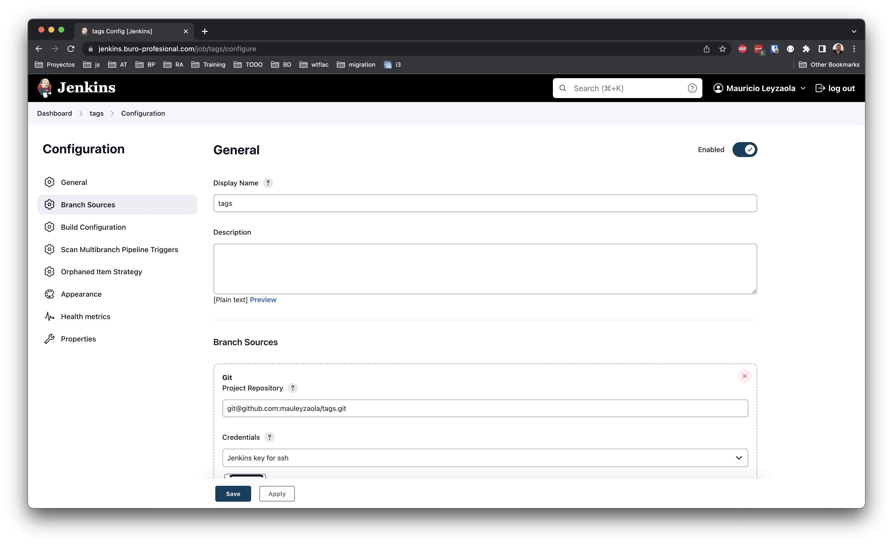

# One Click Jenkins Deployment

Simplest way of having a running Jenkins instance with NGINX and SSL certificate using Let's Encrypt.

## Local Development

Jenkins can run locally, pretty much the same way it runs on a real domain, but without any certificate process.

To start Jenkins

```
make start
```

To stop Jenkins

```
make stop
```

To get the admin default password

```
make password
```

Jenkins HOME will be mapped to `$HOME/jenkins_home` directory.

## How to use

This is for running Jenkins with a certbot generated certificate, and from a valid an existing domain.

This procedure assumes you have latest docker installed on your machine. The machine should be able to resolve a domain from the Internet.

```
cp .env-sample .env
```

Edit the environment values accordingly. Then run docker compose

```
docker compose up -d && docker compose logs -f
```

If you want the docker compose to run as service in Ubuntu 22.04, run these commands:

```
sudo cp config/my-jenkins.service /etc/systemd/system/my-jenkins.service
sudo systemctl enable my-jenkins.service
```

To start the service:

```
sudo service my-jenkins start
```

To stop the service.

```
sudo service my-jenkins stop
```

## Docker

This procedure is for running Jenkins standalone within a docker container, which has a bunch of advantages.

Fist, we need to build a custom docker image based on Jenkins. This is needed so we can run docker from within a containerized Jenkins instance.

I've had issues trying to configure plugins such as CMake. So, would rather install `make` manually myself.

```
docker build -t myjenkins -f config/docker/Dockerfile .
```

Once the docker image has been built, we can run it locally for testing all is good.

```
docker run -d --rm \
--name jenkins \
-p8080:8080 \
-v /var/run/docker.sock:/var/run/docker.sock \
-v jenkins_home:/var/jenkins_home \
myjenkins:latest
```

## Jenkins

Manage Credentials -> System -> Global Credentials -> New Credentials

Add `SSH Username with Private Key`

Scope: Global
Id: `jenkins-ssh`
Username: `mauleyzaola`
Private key: `cat ~/.ssh/id_rsa | pbcopy`

Check `Treat username as secret`

```
You're using 'Known hosts file' strategy to verify ssh host keys, but your known_hosts file does not exist, please go to 'Manage Jenkins' -> 'Configure Global Security' -> 'Git Host Key Verification Configuration' and configure host key verification.
```
Finally, don't forget to verify ssh host keys. Choose `Accept first connection` option from the dropdown and save.

### Github Repositories Authentication

**NOTE**: Consider that using a private key with username works just fine, only be careful to use a ssh url, instead of a https one.

For instance: `https://github.com/mauleyzaola/reside-utils` should be configured as `git@github.com:mauleyzaola/reside-utils.git`

### Plugins

* Basic Branch Build Strategies
* Git
* Go (remember the name should match with the Jenkins file pipeline -> tools)
* Docker

~~Need to configure `Manage Jenkins -> Nodes -> Configure Clouds` and add Docker. Use `docker` as name.~~

Then configure `Go` plugin `http://localhost:8080/manage/configureTools/` name it `go`, so it matches the code in pipeline on this repo.

### Configuration

Make sure we use only `git` plugin and configure these values

Git: Discover branches
Git: Discover tags
Build Strategies -> Regular Branches
Build Strategies -> Tags

Set `Ignore tags older than` to `7 days`




### Jenkins Administrator Password

```
docker exec -it jenkins cat /var/jenkins_home/secrets/initialAdminPassword
```